# Backend documentation for sproul.club
This repository houses all of the backend documentation for the sproul.club project.

Table of Contents:

<!-- MarkdownTOC -->

* [Installation / Setup](#installation--setup)
    * [Recommended third-party tools](#recommended-third-party-tools)
* [How does the project work?](#how-does-the-project-work)
    * [Service Architecture](#service-architecture)
    * [API Design](#api-design)
        * [Authentication](#authentication)
            * [How do we secure our API against unwanted intruders while letting our users access their data?](#how-do-we-secure-our-api-against-unwanted-intruders-while-letting-our-users-access-their-data)
            * [How does JWT-based authentication work?](#how-does-jwt-based-authentication-work)
            * [How can we address the compromised access token problem?](#how-can-we-address-the-compromised-access-token-problem)
            * [What happens when both tokens are compromised?](#what-happens-when-both-tokens-are-compromised)
            * [How do we implement this form of authentication in our backend?](#how-do-we-implement-this-form-of-authentication-in-our-backend)
        * [Data Models](#data-models)
            * [How dows MongoDB work and store its data?](#how-dows-mongodb-work-and-store-its-data)
            * [How can our backend read/write with our database?](#how-can-our-backend-readwrite-with-our-database)
        * [Recommendation systems](#recommendation-systems)
            * [How to design a recommendation system?](#how-to-design-a-recommendation-system)
            * [How to deploy said recommendation system to the backend?](#how-to-deploy-said-recommendation-system-to-the-backend)
            * [How does backend interact with the recommendation system?](#how-does-backend-interact-with-the-recommendation-system)
        * [Monitor Dashboard](#monitor-dashboard)
    * [Reusable logic with decorators](#reusable-logic-with-decorators)
        * [How do decorators work?](#how-do-decorators-work)
        * [What are some real-world applications of decorators?](#what-are-some-real-world-applications-of-decorators)
        * [How to \(efficiently\) implement decorators?](#how-to-efficiently-implement-decorators)
    * [Extending functionality with Flask middleware](#extending-functionality-with-flask-middleware)
    * [A primer on 3rd-party services](#a-primer-on-3rd-party-services)
* [API Documentation](#api-documentation)
    * [Base URLs](#base-urls)
    * [API categories](#api-categories)
        * [Note about error responses](#note-about-error-responses)

<!-- /MarkdownTOC -->

# Installation / Setup

The main steps for setting this up on your machine is as follows:
1. Clone the repository
2. Setup a new Python 3 virtual environment
3. Install the required dependencies...*within the environment!*
4. Create the environment file
5. Run the application

I won't go over how to handle steps 1-3 since each platform (Windows, Mac, or Linux) has its own specific setup. As for setting up the environment file, here's the environment variables required to run the application:

```bash
DEV_MODE=

SECRET_KEY=
CONFIRM_EMAIL_SALT=
RESET_PASSWORD_SALT=

MONGO_URI=

MAIL_SERVER=
MAIL_PORT=
MAIL_USERNAME=
MAIL_PASSWORD=
MAIL_USE_SSL=
MAIL_USE_TLS=
MAIL_SENDER=

S3_REGION=
S3_BUCKET=
S3_KEY=
S3_SECRET=

SENTRY_URL=

GOOGLE_OAUTH_CLIENT_ID=
GOOGLE_OAUTH_CLIENT_SECRET=
```

You'll be provided the values of these environment variables by your lead developer.

The name of this environment file depends on the type of environment you're setting up: either Production (`prod`), Staging (`staging`), Development (`dev`), or Local (`local`). For example, if we wanted to setup the *development* environment, you would name your environment file to `.env.dev`, with the codename appended at the end of the filename. Similarly, to setup the *production* environment, you would name your environment file to `.env.prod`.

For context, you'll typically only setup the **`local`** environment on your machine. The `local` environment is used when you're running both frontend and backend applications on your machine and the other environments correspond to the respective applications hosted on Heroku. The main reason the naming of these environment files is important is that each environment configuration will control what database is being loaded, how email links are formatted, and where those email links redirect you when resetting your password or confirming your account.

## Recommended third-party tools

While you're totally fine to start developing right away, there's a few tools that I'd **highly** recommend downloading to speed up your development time.

* [**MongoDB Compass**](https://www.mongodb.com/products/compass) - MongoDB Compass is a database exploration tool that lets developers explore through the various collections and documents. It's also helpful for quickly making edits to the data as well as testing your queries and aggregation pipelines.

    

* [**Postman**](https://www.postman.com) - Postman is a service that allows developers to test their APIs with a desktop app providing an easy-to-use interface. It's helpful when you need to test your API calls without having to write lengthy cURL requests on your terminal. We use Postman to maintain a set of API collections for backend, where you can easily test the API within the desktop app. You can checkout those collections by [checking out the API Documentation](#api-documentation) and selecting one the major API categories and then clicking the "Run in Postman" button.

    

* **Any desktop Git client** - While you may have learned about using the `git` CLI to make commits and push them to various repositories, I've personally found desktop Git clients to be helpful for boosting productivity. These desktop apps provide a visual interface to see how the commits within the branches of a repository are lined up, and it makes it easy to make your own commits without memorizing the commands.

    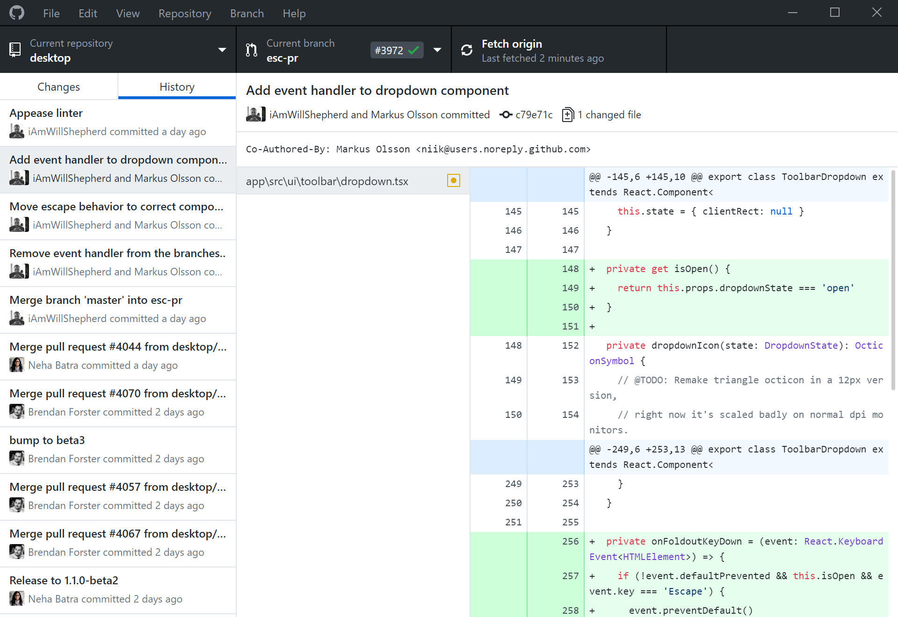

    On top of that, resolving merge conflicts is much easier since they often have have intuitive UI to let the developer pick which parts are to be merged and discarded.

    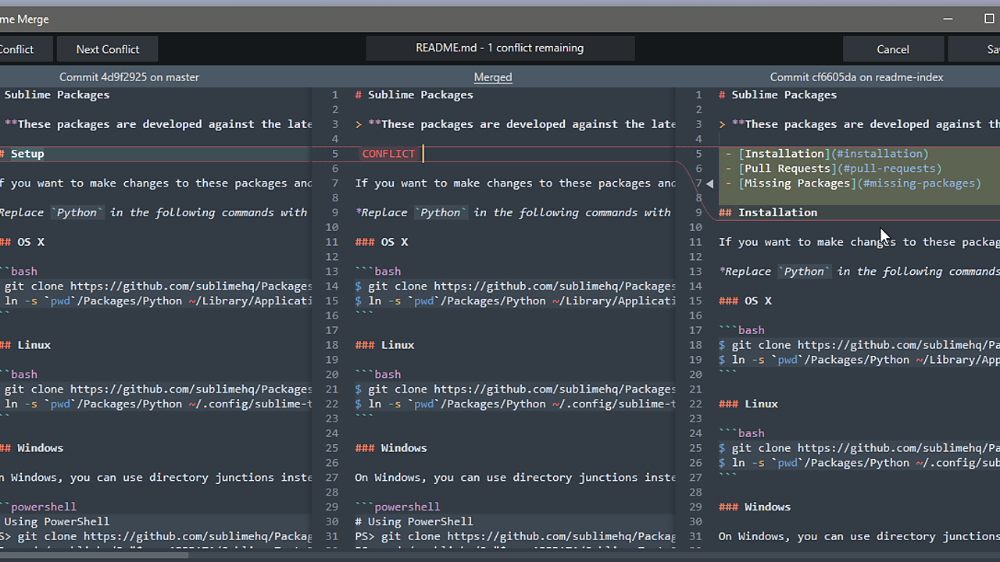

    If you're interested, here's a few popular Git clients to try out. Alternatively, code IDEs such as VSCode and Atom have Git clients built-in so those may work better for you.

    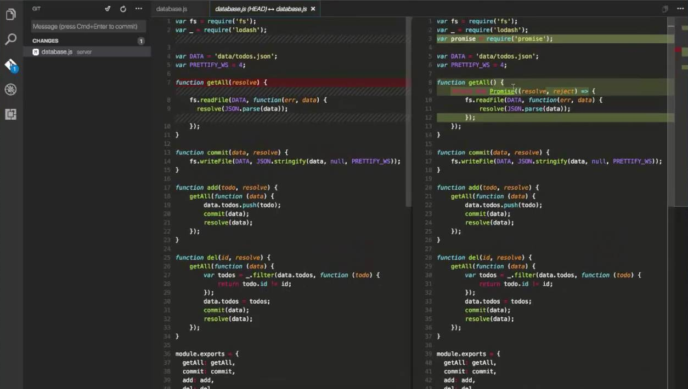

List of popular Git desktop clients:
* [GitHub Desktop](https://desktop.github.com)
* [GitKraken](https://www.gitkraken.com)
* [Sublime Merge](https://www.sublimemerge.com)
* [VSCode (built-in)](https://code.visualstudio.com)
* [Atom (via the "GitHub" package)](https://atom.io)

# How does the project work?

This section will briefly go over how the various components within the application work. It's by no means exhaustive and it assumes that you have some experience in backend and Python. If you have questions about certain aspects of backend not covered in the docs here, feel free to either reach out to your lead developer or otherwise Google is your friend. ;)

## Service Architecture

The image below describes how the backend interacts with other third-party services and the outside world. Note that it only includes services that are *directly* used in API calls, so Sentry and MongoDB Atlas are not shown here.

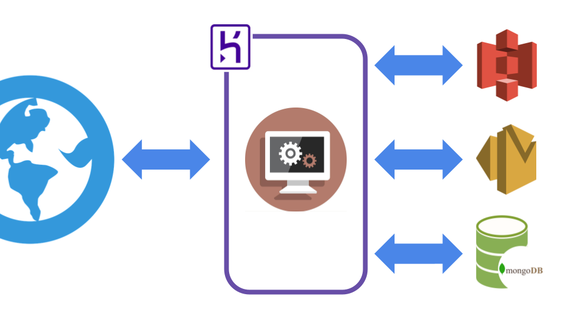

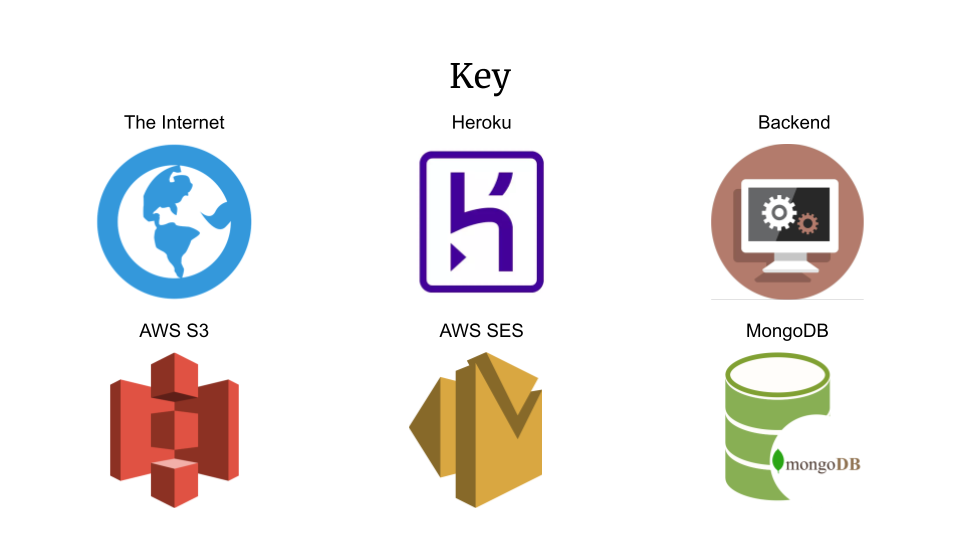

## API Design

The API design of sproul.club is not that different to what you would find in most other backend systems. It's essentially a CRUD (create/read/update/delete) interface between the user and the data within your database. With that said, there are some nuances to keep track of when working with each sub-section of the codebase.

### Authentication

#### How do we secure our API against unwanted intruders while letting our users access their data?

When you normally send your login details to your favorite app like Instagram or TikTok, you normally don't have to worry about re-logging in again or worry about your credentials being leaked. However, what happens if someone obtains access to your credentials? Typically you'll have some mechanism to lock your account from intruders to prevent further damage and you'll often change your password.

So here comes the "tough" question...how do you secure your API from intruders while allowing your users to access your data securely?

Sure you can send the user credentials everytime they want to access their private data (i.e. for every API call), but that's a security risk if someone obtains or intercepts the credentials. Then they can access all the private data that they want. So one of the better ways to handle this problem is with **JSON Web Tokens** (JWTs). It's a three-part token that has a header, payload, and signature (all base64-encoded) that describes how to verify its signature and decode its payload.

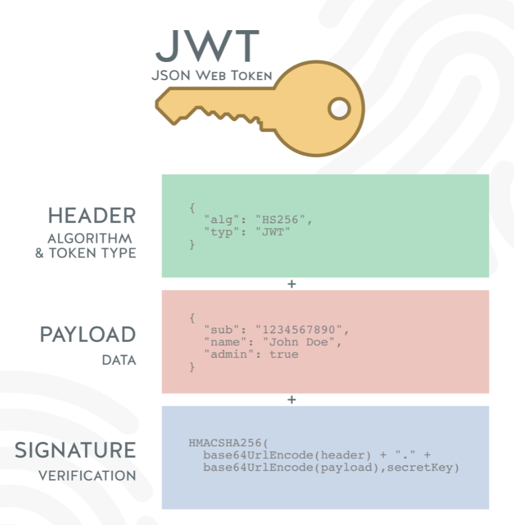

#### How does JWT-based authentication work?

Imagine that you (a.k.a the user) are booking a stay at a 5 star hotel that has top-of-the-notch security. You can use the bathroom and chill in the lobby, but in order to use the pool, bar and stay in a room (a.k.a *private resources*), you need a card to get in. After you make your booking, your hotel reception hands you a card (a.k.a an access token) that's set to expire every three days for security sake. From there, you can freely use your card until it expires in those three days, when you'll need to request a new card.

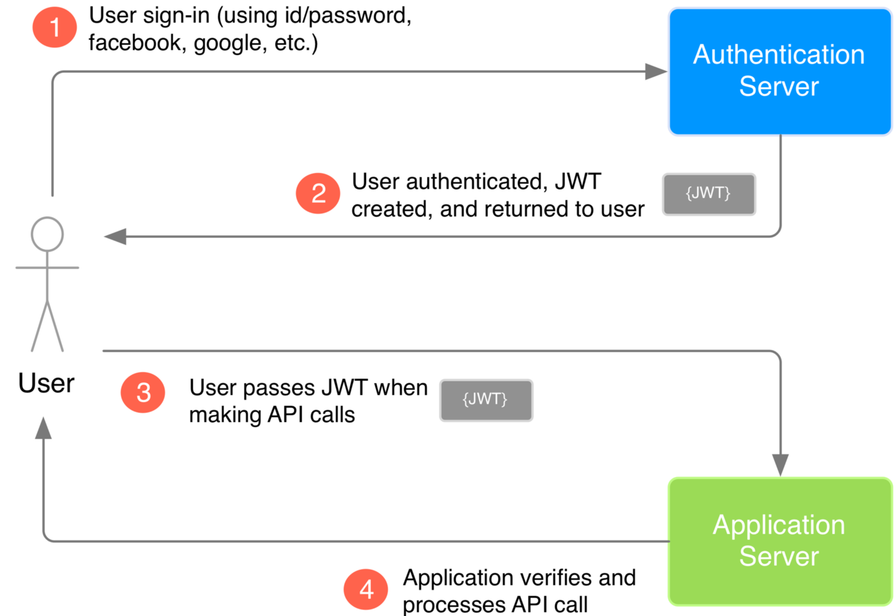

This analogy is the equivalent of what's described in the diagram above. This access token is what allows the user to access their private data in place of having to send their login credentials everytime. We still have one problem though: what happens if that access token is compromised? Well sending that access token is no different that sending your login credentials for every API call and we come back to square one.

#### How can we address the compromised access token problem?

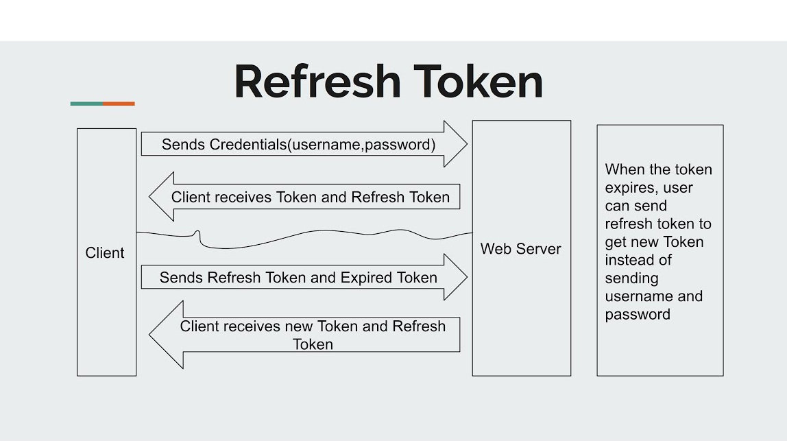

However, all hope is not lost, as we can have another token called a refresh token. This refresh token isn't a complete solution but it mitigates the problem by being able to control if the access token is valid or not. So going back to the analogy, let's say that you get two cards, an access card (access token) and a refresh card (refresh token). You still use your access card to access those private facilities and your room while you keep your refresh card safe in your personal safe.

Let's say someone steals your access card! Well luckily your hotel has a system to invalidate access cards if you show them your refresh card. They'll give you a brand new access card while invalidating your old access card, and you don't have to worry about that thief stealing your stuff in the future. The point here is that you have a token that essentially governs control over your main token as a security precaution. You can use this refresh token to get a new access token either in the event that your access token expires (as shown in the above diagram) or is compromised.

#### What happens when both tokens are compromised?

Obviously there's not much that you can do if *both* your access and refresh tokens are compromised, but it's less likely that you'll compromise both tokens rather than one. This system isn't perfect but it's the best that you can do. Needless to say, authentication is tricky to implement correctly and ultimately while you can't idiot-proof your system for your users, you can do your best to proect their data from intruders as much as you can.

#### How do we implement this form of authentication in our backend?

In practice, we use a Flask library called [flask-jwt-extended](https://github.com/vimalloc/flask-jwt-extended), which makes it relatively easier to implement all this functionality, from generating new tokens to managing a list of invalidated tokens with the refresh token system and more.

Check out the flask-jwt-extended libary [here](https://github.com/vimalloc/flask-jwt-extended), and their documentation [here](https://flask-jwt-extended.readthedocs.io/en/stable)!

### Data Models

Data is the centerpiece for all backend systems, so having an easy way to access and manipulate said data is essential. As mentioned in the "[A primer on 3rd-party services](#a-primer-on-3rd-party-services)" section, we use MongoDB as the database.

#### How dows MongoDB work and store its data?

MongoDB uses the concept of collections and documents, where collection contains a set of documents, and each document is a JSON-like object (technically called BSON, which stands for Binary JSON). Each document with a collection typically has a common data schema, although this is not strictly enforced by the database itself. For those of you that are more familiar with relational databases, here's a diagram comparing the nomenclature between the two database environments:

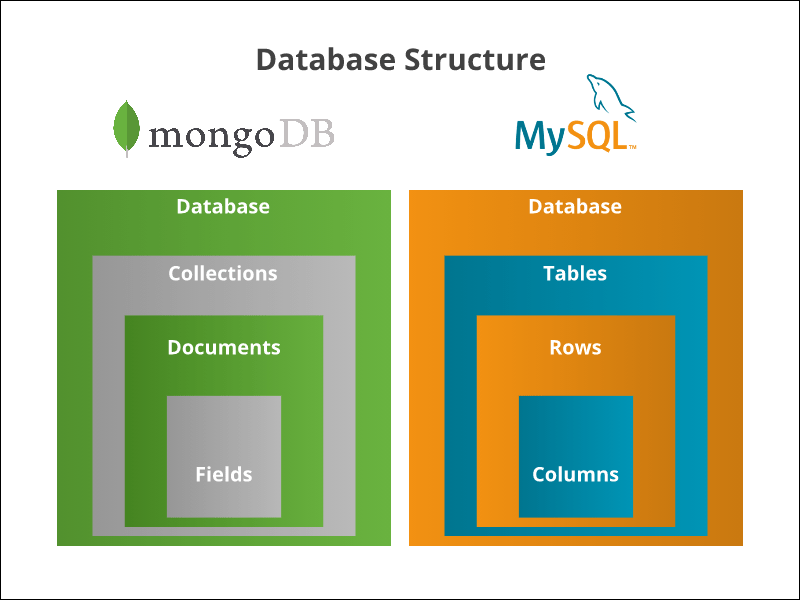

While each document within a collection does not have to follow a set data schema, it's still a good idea to have consistency to avoid unnecessary logic errors within our application. With that in mind, let's talk about database libraries!

#### How can our backend read/write with our database?

There are two types of database adapter libraries:
1. Direct database adapters contain a set of functions that map to the corresponding set of commands you can do in the respective database. It allows for the **most amount of control with the database** in exchange for a lack of means to enforce a schema within the documents in a particular collection.
2. ORM (Object-relational mapping) libraries provide an object-oriented programming (OOP) experience by using classes to define the schema of the set of documents within a collection and using objects to represent its respective document in the database. It provides a **more natural programming interface with the database** in exchange of lack of finer control of reading/writing to the database.

Let's visualize the differences between the two types of libraries by comparing between [`pymongo`](https://github.com/mongodb/mongo-python-driver) (a direct database adapter) and [`mongoengine`](https://github.com/MongoEngine/mongoengine) (an ORM adapter) below:

Example 1: Using [`pymongo`](https://github.com/mongodb/mongo-python-driver), a direct database adapter to read/write data.

```python
from pymongo import MongoClient

# Connect to the database
client = MongoClient(host="localhost", port=27017)

# Access the 'main-db' database
db = client['main-db']

# Access the 'books' collection with the 'main-db' database
books_collection = db['books']

# Define the books that we want to insert into the collection
book1 = {
    'title': 'The cake is a lie',
    'author': 'Doug Rattmann',
    'average_rating': 4.7,
    'number_of_pages': 314,
}

book2 = {
    'title': 'Sometimes...I dream about cheese',
    'author': 'Generic Scientist #213',
    'average_rating': 2.9,
    'number_of_pages': 42,
}

book3 = {
    'title': 'Laughter really is the best medicine!',
    'author': 'Dr. Doom',
    'average_rating': 3.5,
    'number_of_pages': 272,
}

# Insert the first book
result = books_collection.insert_one(book1)

# Insert two more books
books_collection.insert_many([book2, book3])

# Fetch all books and store into 'all_books'
all_books = books_collection.find()

# Fetch a specific book via searching by field and store the result into 'specific_book'
specific_book = books_collection.find_one({'title': 'The cake is a lie'})

# Update a book within the collection with a different rating
books_collection.update_one(
    {'title': 'Sometimes...I dream about cheese'},
    {'average_rating': 3.2}
)

# Delete a book from the collection
books_collection.delete_one({'author': 'Dr. Doom'})

# Close the connection to the database
client.close()
```

Example 2: Using [`mongoengine`](https://github.com/MongoEngine/mongoengine), a class-based database adapter to read/write data.

```python
from mongoengine import connect
from mongoengine import Document, StringField, IntField, FloatField

# Connect to the database
connert(host='localhost', port=27017, db='main-db')

# Define a Book class to represent all the books in the collection
class Book(Document):
    title = StringField(required=True, unique=True, max_length=70)
    author = StringField(required=True, max_length=20)
    average_rating = FloatField(required=True, min_value=0, max_value=5)
    number_of_pages = IntField(required=True, min_value=1)

# Define the books that we want to insert into the collection
book1 = Book(
    title='The cake is a lie',
    author='Doug Rattmann',
    average_rating=4.7,
    number_of_pages=314,
)

book2 = Book(
    title='Sometimes...I dream about cheese',
    author='Generic Scientist #213',
    average_rating=2.9,
    number_of_pages=42,
)

book3 = Book(
    title='Laughter really is the best medicine!',
    author='Dr. Doom',
    average_rating=3.5,
    number_of_pages=272,
)

# Insert the first book
book1.save()

# Insert two more books
Book.objects.insert([book2, book3])

# Fetch all books and store into 'all_books'
all_books = Book.objects

# Fetch a specific book via searching by field and store the result into 'specific_book'
specific_book = Book.objects(title='The cake is a lie').first()

# Update a book within the collection with a different rating (via a variable)
updated_book = Book.objects(title='Sometimes...I dream about cheese').first()
updated_book.average_rating = 3.2
updated_book.save()

# Delete a book from the collection (via a variable)
to_be_deleted_book = Book.objects(author='Dr. Doom').first()
to_be_deleted_book.delete()

# Close the connection to the database
client.close()
```

The main differences to take away are the ease of programming styles between the two adapters. We use `mongoengine` since it allows for less chances to mess up with database logic and makes it easy to read through the code in a more English-like manner.

### Recommendation systems

One of the cooler features of sproul.club is the recommendation systems, embedded within the similar clubs feature and soon to be implemented in the upcoming recommended clubs for students. These recommendation systems are often (but not restricted to) machine learning models that are trained from our data and updated on a regular basis (i.e. every few hours).

#### How to design a recommendation system?

Generally you won't have to worry about how the model works, although you may need to work with people that are doing so, and thus it's important to understand the how model designing works.

Here's the general process of how designing and training each recommendation system works:
1. Figure out what problem we're trying to solve.
2. Collect the raw data needed for the model.
3. Perform some preliminary analysis to see what features are useful.
4. Start experimenting with different model designs and keep iterating until we have some with acceptable performance.
5. Clean up and productionize the code so that it's ready to deploy onto the backend.
6. Repeat steps 4-6 for improving the model.

Most of our work for designing the models is under the [sc-notebook](https://github.com/sproul-club/sc-notebook) repository via the various Jupyter Notebooks. Feel free to explore the notebooks to get a better idea on how these models work specifically.

#### How to deploy said recommendation system to the backend?

Right now, we don't have the cleanest way of deploying these recommendations systems. Ideally, we'd have a separate server that just has the system so that backend can call it as when necessary without maintaining its functionality itself. Since we're using Heroku and we're on their *free* plan, we had to resort to deploying the model alongside the backend. This is hopefully a temporary fix and we hope to address this soon.

Anyways, here's the process for putting our models on the backend:
1. Extract the necessary code to run the model from the Jupyter Notebook.
2. Figure out what dependencies are required to run the model. Make sure to clean up unneeded ones from the notebook before doing this step.
3. Create an interface to house all the extracted code. The similar clubs feature uses a class that houses a `recommend()` function as well as a `train_or_load_model()` for either training its own model on the fly or loading a model from a file. While you don't have to train your model on the fly, it's helpful especially when new clubs or students register, so along with your inferencing code, you should include your training code.
4. Implement the code needed to load the model on startup. If needed, also implement a scheduled job to periodically re-train the model as and when needed. You can refer to the bottom part of [`app.py`](https://github.com/sproul-club/sc-backend/blob/master/app.py) for an example on how to do this (look for `BackgroundScheduler`). You can also refer to the [Advanced Python Scheduler library](https://github.com/agronholm/apscheduler), which allows you to schedule long-running, periodic tasks within a Python app.

You can check out [an example](https://github.com/sproul-club/sc-backend/blob/master/recommenders/club_recommender.py) of this whole process implemented for the similar clubs model, with on-the-fly training included.

#### How does backend interact with the recommendation system?

From a backend perspective, you won't have API calls to directly fetch the output of a recommendation system given some input. Rather, it'll be organically integrated with some other output. For example, when you visit a club page, there's an API call to fetch the details of the club. During that API call, it'll call upon the similar clubs model to find out what clubs are similar to it and incorporate that into the response, like in this example (*truncated*) response:

```JSON
{
    "name": "Example Club",
    "link_name": "example-club",
    "about_us": "This is something about the club.",

    "recommended_clubs": [
        {
            "name": "Example Club 1",
            "link_name": "example-club-1",
            "logo_url": "<logo-pic-url>"
        },
        {
            "name": "Example Club 2",
            "link_name": "example-club-2",
            "logo_url": "<logo-pic-url>"
        },
        {
            "name": "Example Club 3",
            "link_name": "example-club-3",
            "logo_url": "<logo-pic-url>"
        },
    ]
}
```

Feel free to refer to the [Catalog API Blueprint](https://github.com/sproul-club/sc-backend/blob/master/blueprints/catalog_blueprint.py) and check out the `get_org_by_id` function for an idea of how that interaction works.

### Monitor Dashboard

**NOTE: As of now, there's no feasible way to add new users to be able to log into the system. We're working on fixing this so stay tuned!**

If you've been peering through the codebase and the documentation, you've probably noticed that there's this "Monitor API" that doesn't seem to be used in the frontend application. That's because that API powers our [secret custom-built admin dashboard](https://github.com/sproul-club/sc-admin)! This dashboard provides us with metrics such as the number of clubs with confirmed email accounts vs all registered clubs, the number of club admins currently logged in, the social media link usage, and more, as well as admin functionality for adding new club emails to the RSO list, downloading all the club details to a CSV, and more.

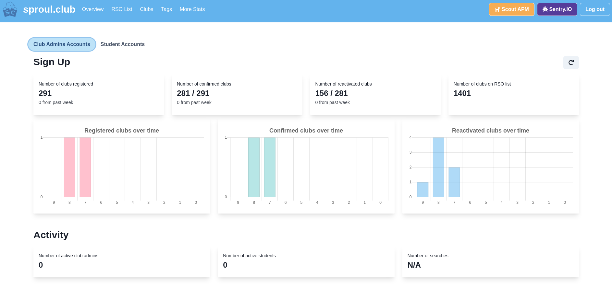

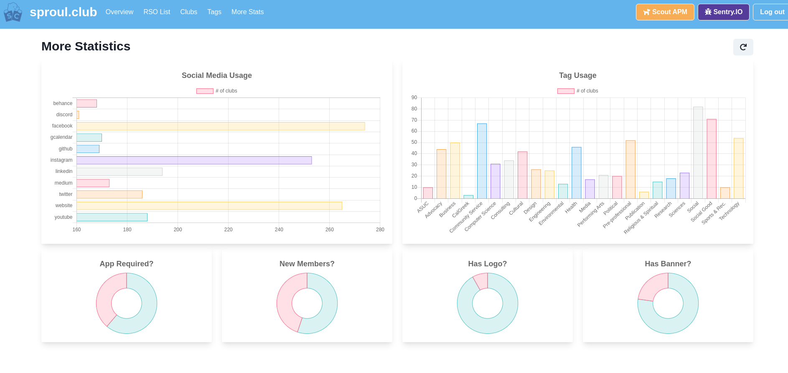

If you love working with data and if you love working with data visualizations, then working on this dashboard will be perfect for you! There are a few things to keep in mind if you plan to work with it:

1. You'll need sufficient knowledge working with MongoDB, especially with [MongoDB aggregations](https://docs.mongodb.com/manual/aggregation). If you don't know what they are, they essentially allow computations of existing data on the database, as opposed to doing said computations on the backend itself. I won't cover how aggregations work here, since it's not required to know about them for the majority of backend development. With that said, here's a quick guide on [how to work with aggregations](https://appdividend.com/2018/10/25/mongodb-aggregate-example-tutorial) and [another guide using MongoDB Compass](https://www.analyticsvidhya.com/blog/2021/06/how-to-aggregate-pipeline-with-mongodb). I'd highly recommend downloading and using [MongoDB Compass](https://www.mongodb.com/products/compass) to play with aggregations, as it gives you a nice visualizer for how your data is computed and processed within the aggregation pipeline.
2. While it's not strictly required, if you want to add your data visualizations or add new features to the dashboard, you'll need to know some frontend programming, specifically with React. The frontend codebase should be relatively simpler than what you'll find on the main frontend codebase, but due to the nature of React's coding style, it's probably better if you talk to a frontend engineer to help with this. To start, feel free to check out the [Chakra UI library](https://chakra-ui.com) that's used to style the web application, the [Apache eCharts library](https://echarts.apache.org/en/index.html) which houses [a huge collection of various charts](https://echarts.apache.org/examples/en/index.html) and the corresponding [eCharts React library](https://github.com/hustcc/echarts-for-react).
3. (**WIP**): Since there's no process to sign up new users, you'll need to insert a new user into the database. Right now, we're working on a script to insert new users given a username and password combo so stay tuned for that.

## Reusable logic with decorators

Python decorators are an integral part of every Flask app. They are functions that essentially wrap around a "main" function such there can be logic called before and after that "main" function.

### How do decorators work?

To visualize that, let's consider the following toy example:

```python
def some_loud_decorator(func):
    def wrapper_function():
        print("Something is happening before the function is called.")
        func()
        print("Something is happening after the function is called.")
    return wrapper

def say_hello_world():
    print("Hello World!")

say_hello_loudly = some_loud_decorator(say_hello_world)
```

Running this code produces the following output:

```bash
>>> say_hello_loudly()
Something is happening before the function is called.
Hello World!
Something is happening after the function is called.
```

For more information about how to use and implement decorators, you can refer to [this guide](https://realpython.com/primer-on-python-decorators).

### What are some real-world applications of decorators?

If you've made a Flask app before, you've already used decorators before, and this application is no different! Along with Flask's built-in decorators, we also make our own custom decorators to avoid duplicating common logic within our app. Let's look at a real example endpoint function for fetching all the details of the club profile:

```python
@app.route('/profile', methods=['GET'])
@jwt_required
@role_required(roles=['officer'])
def fetch_profile():
    # FIXME: Implement code to fetch profile

    pass
```

Here we have a few decorators at play, both from Flask and from our own custom ones:
1. The first decorator tells Flask to only call this function if a GET request with the reuqested URL endpoint being '/profile' is found.
2. The second one checks if a JWT token is present within the `Authorization` header and otherwise returns a `401 Unauthorized` response. Since the JWT has user information, it wouldn't make sense for someone without a user account to access their non-existent user account.
3. The last one if the correct user type is trying to access the endpoint and otherwise returns a `401 Unauthorized` response. This allows us to restrict endpoints for either student users or club officer users or even more. It wouldn't make sense for a student to edit their non-existent club.

Note that the ordering of decorators is important, as some of them are required before others. Luckily, the ordering of the list above is the same ordering that the decorators get called before `fetch_profile` is called, so it's just as intuitive as reading code.

### How to (efficiently) implement decorators?

One last point: oftentimes the syntax for implementing more complex decorators (especially when they accept arguments) is pretty complicated. That's why I'd highly recommend checking out the aptly-named [decorator library](https://github.com/micheles/decorator). This library makes it darn easy to implement your own decorators as opposed to the examples seen in the [aforementioned guide](https://realpython.com/primer-on-python-decorators) and I encourage you to make your own if you find some set of code that can be de-duplicated and made into a reusable function.

Check out the decorator libary [here](https://github.com/micheles/decorator), and their documentation [here](https://github.com/micheles/decorator/blob/master/docs/documentation.md)!

## Extending functionality with Flask middleware

Flask by itself doesn't provide a whole lot of functionality. It's self-described as a "micro web framework", which means that there isn't any additional functionality packaged within the Flask package. It also means that it doesn't make any decisions regarding what database adapter to use, what data format to work with, and etc. With that said, Flask does support the concept of adding intermediary packages (a.k.a "middleware") to enhance your application's functionality.

Here's an example of attaching a few common third-party middlewares onto your Flask app, including a middleware to [secure yourself against web app common security issues](https://github.com/GoogleCloudPlatform/flask-talisman), a middleware to [allow CORS support](https://github.com/corydolphin/flask-cors), and a middleware to [automatically compress your responses](https://github.com/colour-science/flask-compress).

```python

from flask import Flask

from flask_cors import CORS
from flask_talisman import Talisman
from flask_compress import Compress

app = Flask(__name__)

CORS(app)
Talisman(app)
Compress(app)

@app.route("/")
def hello_world():
  return "Hello World!"

if __name__ == '__main__':
    app.run()
```

These middleware packages are similar to decorators, in the sense that they inject themselves into the app and the request / response mechanism. They may either check for some specific fields in a header or manipulate the incoming request or outgoing response for either all endpoints or select endpoints.

Attaching middleware is fairly simple and allows you to easily add the features you need. Typically, you won't need to write your own middleware since your logic won't be used by other developers, and it's easier to write decorators for the sake of reusable logic. If you want to see what middleware we use, check out [`init_app.py`](https://github.com/sproul-club/sc-backend/blob/master/init_app.py) on the backend repository.

## A primer on 3rd-party services

Before we jump into the internals of the project, we need to talk about the various *third-party services* that we use. These services all collectively allow us to move faster with development, whether it be not having to setup servers and server racks, or providing us with an extra pair of eyes to track runtime errors, or giving us a virtual place to store and manage our data. With that said, each service will have its drawbacks that we cannot control, and it's important to understand the pros and cons of using these managed services over setting it up ourselves.

* [**Amazon Web Services (AWS)**](https://aws.amazon.com) - Amazon Web Services is a cloud platform that offers a sleuth of services from running virtual machines to deploying machine learning models on the web to managing your IoT (Internet of Things) devices and much more. We use some of AWS's services for storing our images and sending out emails for now. You'll most likely not be touching the AWS dashboard but you will be working with their services via third-party libraries. For a full list of their products, click here: https://aws.amazon.com/products.

    Click here to watch their intro video to AWS: https://www.youtube.com/watch?v=a9__D53WsUs

    * [**AWS S3**](https://aws.amazon.com/s3) - AWS S3 (or Simple Storage Service) is an object storage service for storing all kinds of files. It's what lets us store each club's logo and banner photos.

        * Click here to watch their intro video on AWS S3: https://www.youtube.com/watch?v=77lMCiiMilo

    * [**AWS SES**](https://aws.amazon.com/ses) - AWS SES (or Simple Email Service) is a service for sending mass amounts of emails easily. It's what lets us send out password reset and account confirmation emails.

        * Click here to watch their intro video on AWS SES: https://www.youtube.com/watch?v=Xsw9Lv7Xv40

* [**Heroku**](https://www.heroku.com) - Heroku provide the means for developers to deploy a web application from a repository like from GitHub to the internet without worrying about servers, networking, storage and other details. It is called a "Platform-as-a-service" (*PaaS*) because they provide their cloud platform to deploy web applications as a service. It's what we use to deploy our frontend and backend applications to the web with little to no hassle. You'll most likely not be touching the Heroku dashboard though.

* [**MongoDB**](https://www.mongodb.com) - MongoDB is the database that we use to store all of our data (excluding images). It's a NoSQL (not only SQL), document-oriented database that's well known for their potential in rapid development due to storing data in JSON-like documents with flexible data schemas, unlike what you would find in relational databases. We chose MongoDB since we needed to be able to quickly iterate through multiple versions of data schemas with little to no friction between our business requirements and our method of data storage. You'll most likely be interacting with the database either via the application or by using a data exploration tool like [MongoDB Compass](https://www.mongodb.com/products/compass).

    Here's a visual representation of the difference between how one would store data in a relational database vs a document-oriented database.

    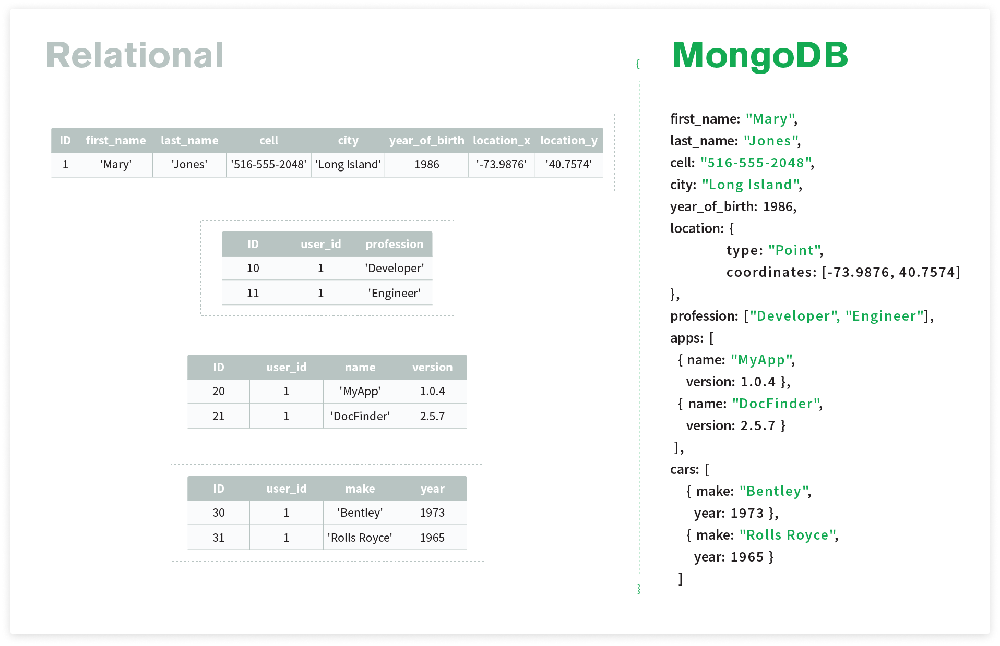

* [**MongoDB Atlas**](https://www.mongodb.com/atlas) - MongoDB Atlas is MongoDB's "Database-as-a-service" (DBaaS) offering, which lets you host a MongoDB instance under their name. It lets us not worry about the finer details of having a server specifically for hosting MongoDB so that we only have to deal with the database itself. You'll most likely not be touching Atlas dashboard though.
* [**Sentry**](https://sentry.io) - Sentry allows us to track uncaught exceptions and also do performance monitoring by capturing the incoming request and outgoing response for each error caught. We use their dashboard to analyze the frequency of these requests as well as see if they are from the same user, same browser and so on. You'll most likely be using the dashboard to see what errors have popped up in the production version of your app.

    

# API Documentation

All the publicly exposed endpoints are documented here and in our Postman collections. It's important to make sure that these set of documents are updated when adding/changing/deleting features.

## Base URLs

* Base URL (development): https://sc-backend-dev.herokuapp.com
* Base URL (production): https://sc-backend-prod.herokuapp.com

## API categories

* [Admin API](docs/api-docs/Admin-API.md)
* [Catalog API](docs/api-docs/Catalog-API.md)
* [Monitor API](docs/api-docs/Monitor-API.md)
* [Student API](docs/api-docs/Student-API.md)
* [User API](docs/api-docs/User-API.md)

### Note about error responses
All endpoints except for account confirmation and password reset emails will return a response with a code between 4XX and 5XX, and of the following form:
```json
{
    "status": "error",
    "reason": "Sample error message",
    "data": [
        "any extra data goes here"
    ]
}
```
